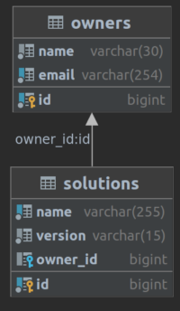
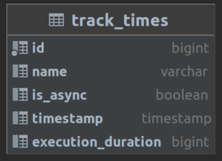

# microservices-kafka-spring-aop 
_первоначальная версия приложения "SpringAOP" находится в ветке SpringAOP_

Приложение было доработано, проведён рефакторинг:
- выделено 2 микросервиса consumer-service  и  produser-service
- сщт

Приложение реализует систему учета времени выполнения методов в приложении с использованием Spring AOP,
оно способно асинхронно логировать и анализировать данные о времени выполнения методов

___

_by Ruslan Rodionov_

___

### Общее описание приложения:
- реализует CRUD методы для работы с сущностями Owner и Solutions;
- аннотации @TrackTime и @TrackAsyncTime, применяются к методам работы с демо-сущностями для отслеживания времени их выполнения;
- сервис TrackTimeService асинхронно сохраняет время работы методов, а так же реализует возможность получения этих данных;

- 
- Струтура БД:

### Запуск приложения:
Поднимаем контейнер Docker с БД из файла:
[docker-compose-spring-aop-db.yaml](docker-compose-microservices-kafka-spring-aop.yaml)

после запускаем приложение в IDE;

###  Postman 
Для полного тестирования приложения предусмотрена коллекция Postman.
Запуск коллекции необходимо производить последовательно, так как тесты зависят от результатов выполнения предшествующих
[SpringAOP.postman_collection.json](postman/SpringAOP.postman_collection.json)

### _Техстэк:_
- #### Java 17
- #### Spring Boot
- #### MockMVC
- #### PostgreSQL
- #### Maven
- #### Docker
- #### Hibernate
- #### Mapstruct
- #### Lombok
- #### Slf4j
